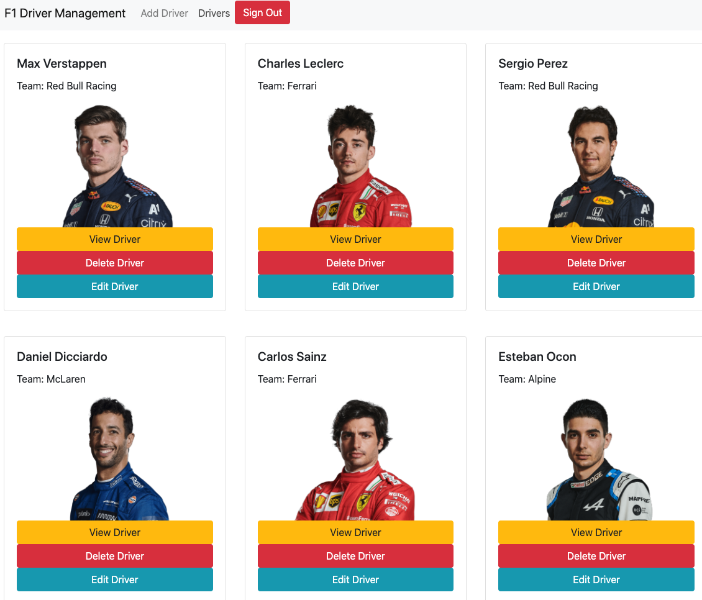

# React Team Roster
The F1 stewards want a way to manage the season's driver roster. Using React I built a full CRUD app to help them do that!
### Link to your wireframes/prototype
  [Wireframe](https://www.figma.com/file/jLN5U6Yw6xGPzeTpgVKFyI/Untitled?node-id=1%3A9)
### Link to the deployed project
  [Deployed Project](https://mg-react-team-roster.netlify.app/)
### Description of the user
  Users who want to monitor and update the current roster of F1 drivers
### List of features                                                
  Built with React!
  Two pages! One to add new drivers with a form, the other containing cards of all existing drivers. Cards contain the driver name, team name, photograph, and edit and delete buttons for the card. Also a view button to see that card individually.
### Screenshots of your project

### List of contributors and links to their GH profiles
@GonzalesMatthew
### Link to Loom video walkthrough of your app
[App-Walkthrough Video](https://www.loom.com/share/d916363f4e804498a58c7710925ed5d0)
